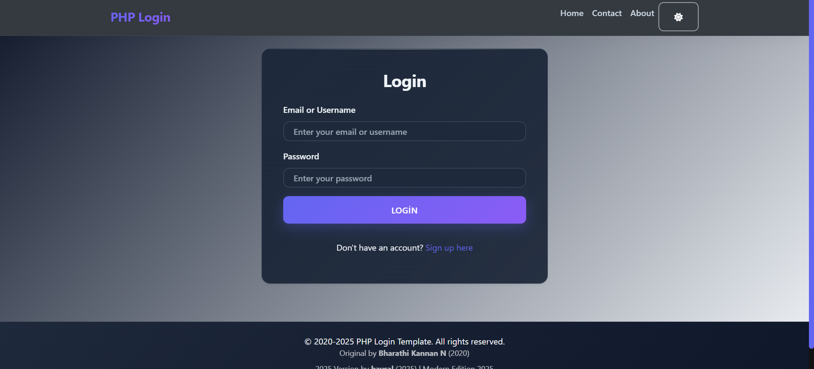

# Modern PHP Login Template 🚀

A customized and modernized version of a classic PHP login template. Fully responsive and styled with modern CSS.

## 🌟 Features
* 📱 **Responsive Design:** Works on mobile, tablet, and desktop.
* 🎨 **Modern UI:** Clean and aesthetic interface using custom CSS.
* 🔒 **Secure:** Basic PHP session management included.
* ⚡ **Fast:** Lightweight, pure CSS & JS (No heavy frameworks).

## 🛠️ Technologies Used
* PHP 7.4+
* HTML5 & CSS3
* JavaScript (Vanilla)

## 🚀 How to Use (Installation)

1.  Download or clone this repository.
2.  Move the project folder to your local server directory (e.g., `htdocs` for XAMPP or `www` for WAMP).
3.  Start your Apache/MySQL module.
4.  Import the `database.sql` file (if you have a database file) via PHPMyAdmin.
5.  Open your browser and go to `localhost/your-project-name`.

## 📜 License & Credits
This project is a modified version of a 2020 template.
* **Original Author:** Bharathi Kannan N
* **Edited by:** Mehmet Baysal (baysal)

Feel free to use it for your own projects!
